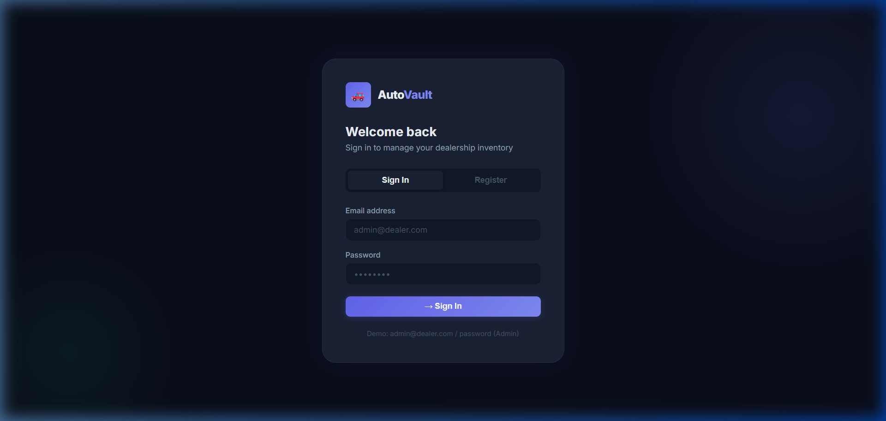
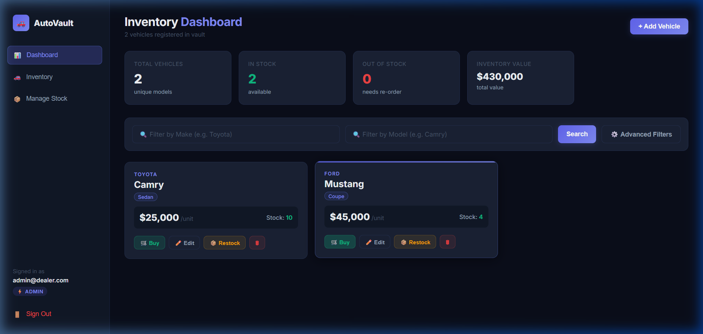
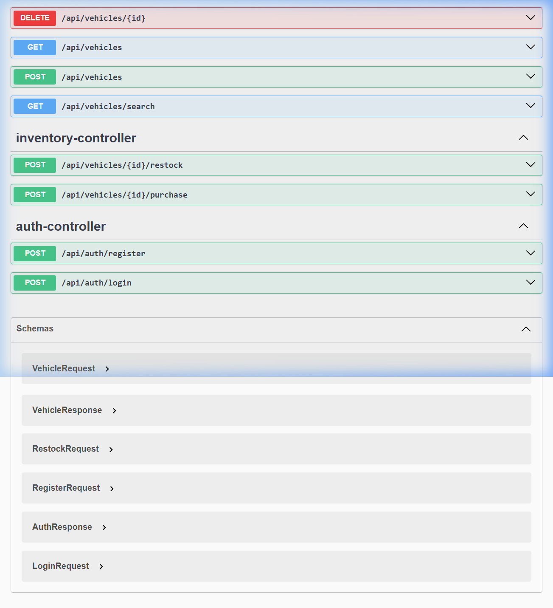

# 🚗 AutoVault - Car Dealership Inventory Management System

AutoVault is a premium, secure, and production-ready Web Application designed for managing car dealership inventories. It offers role-based access control (RBAC), interactive OpenAPI Swagger documentation, live stock auditing, and an advanced criteria search engine.

---

## 💻 Tech Stack

### Backend
* **Spring Boot 3.3** (Java 22)
* **Spring Security** & stateless **JWT** token-based authentication
* **Spring Data JPA** & **Hibernate**
* **Springdoc OpenAPI UI** (Swagger Integration)

### Frontend
* **React 18** (Vite-powered environment)
* **React Router v7** for routing and client-side page guards
* **Axios** with automatic JWT Bearer token request interceptors and 401 token-expiry logic
* **Vanilla CSS** design system featuring modern typography (Inter), glassmorphism cards, grid alignments, and desktop-to-mobile drawer drawer responsiveness.

### Database
* **PostgreSQL (Neon Cloud DB)** for production
* **H2 (In-Memory Database)** for rapid unit and integration testing

### Testing
* **JUnit 5** & **Mockito** (for Unit / Mock tests)
* **MockMvc** Integration Testing (for HTTP requests & filter validation)

### Deployment
* **Vercel** (Frontend static server)
* **Railway** / **Render** (Backend Spring Boot host)

---

## 🎨 Architecture Workflow

```mermaid
graph TD
    subgraph Client Layer (Frontend)
        A[React App] -->|Axios REST Calls| B[JWT Request Interceptor]
    end
    subgraph Server Layer (Backend)
        B -->|HTTP Requests| C[Spring Security Filter Chain]
        C -->|Valid Token| D[JWT Auth Filter]
        D -->|Authenticated Context| E[Spring REST Controllers]
        E -->|Service Logic & Specs| F[JPA Repositories]
    end
    subgraph Database Layer
        F -->|Hibernate SQL Operations| G[PostgreSQL Neon Cloud / H2]
    end
```

---

## 🚀 Features

### 1. Authentication & Session Persistence
* Secure stateless JWT authentication with registration (`/api/auth/register`) and login (`/api/auth/login`) handlers.
* Client-side token storage in `localStorage` utilizing public & private route guards (`ProtectedRoute` / `PublicRoute`).
* Auto-expiry handler: Any HTTP 401 from the server instantly clears expired tokens and redirects the user to the Login page.

### 2. Multi-Role Authorization Gates (RBAC)
* **USER Role View:**
  * Can search the catalog, view vehicles, and **Purchase Vehicles** (reduces stock).
  * Automatically hidden: Add Vehicle dashboard actions, Edit forms, Restock and Delete controls.
* **ADMIN Role View:**
  * Has access to all standard USER operations.
  * Accesses **Stock Management** sidebar panels.
  * Can **Add new vehicles**, **Edit vehicle attributes (CRUD)**, **Restock vehicles**, and **Delete vehicles**.
  * Role gates are validated both on the UI layout and strictly on the Spring Boot Controllers using `@PreAuthorize("hasRole('ADMIN')")`.

### 3. Real-Time Purchase Flow & Lock Guarding
* When purchasing a vehicle, the system checks stock availability and securely decrements it.
* Once the quantity resolves to `0`, the vehicle card turns into an **Out of Stock** state and the **"Buy" button is immediately disabled**.

### 4. Advanced Criteria Search Specs
* Implements a full **JPA Specification Specification** on the backend using the Criteria Builder API.
* Frontend includes an expandable **Advanced Filters** panel allowing granular searches using combinations of:
  * **Make** only (partial case-insensitive matching)
  * **Model** only (partial case-insensitive matching)
  * **Category** only (exact matching)
  * **Price Range** (Min Price / Max Price bounds)
  * Any complex combination of filters together.
  * Leaving parameters blank returns the full catalog.

---

## ⚙️ Setup & Installation

### Prerequisite Environment Variables
Prepare a `.env` file in the project directories:

```env
DATABASE_URL=jdbc:postgresql://<neon_db_url>?sslmode=require
JWT_SECRET=your_super_secret_signing_key_32_chars_or_more
SPRING_PROFILES_ACTIVE=local
PORT=8080
```

### 1. Database Setup
Ensure you have a running PostgreSQL database (e.g. Neon PostgreSQL). The database schema is automatically initialized on startup by Hibernate (`ddl-auto: update`).
The **Database Seeder** automatically verifies and creates the default user accounts and populates 10 demo vehicles if the vehicle table is empty:
* **Admin account:** `admin@dealer.com` / `password` (ADMIN Role)
* **User account:** `user@dealer.com` / `password` (USER Role)

### 2. Run Backend (Spring Boot)
Ensure Java 17+ and Maven are installed.
```bash
cd backend
# Enable Spring local profile using the environment variable configuration
$env:SPRING_PROFILES_ACTIVE="local"  # Windows PowerShell
# Or Unix: export SPRING_PROFILES_ACTIVE=local
mvn spring-boot:run
```
Tomcat will run on port `8080`.

### 3. Run Frontend (React Vite)
Ensure Node.js is installed.
```bash
cd frontend
npm install
npm run dev
```
Open your browser to `http://localhost:5173`.

---

## 📖 API Documentation & Swagger UI

Interactive REST API documentation is generated using Springdoc OpenAPI.
* **Local Swagger URL:** [http://localhost:8080/swagger-ui/index.html](http://localhost:8080/swagger-ui/index.html)
* **JWT Testing:** Use the green `🔓 Authorize` padlock button in the Swagger UI header to paste your JWT token (obtained from register/login) inside the authorization input (`Bearer <JWT>`) to execute protected CRUD endpoints directly in the browser.

---

## 🧪 Test Suite Results

The codebase is fully validated with **34 automated tests** covering service business logic, exceptions, security constraints, and integration MockMvc flows.

### Test Coverage Highlights
* **Unit Tests:** Mockito-driven validation of stock checks, password hashes, and database record mapping.
* **Integration Tests (`MockMvc`):** Fully covers registration/login loops, role-based resource rejection (403 Forbidden checks), CRUD endpoint validation, and stock constraints.

```text
[INFO] Results:
[INFO] 
[INFO] Tests run: 34, Failures: 0, Errors: 0, Skipped: 0
[INFO] 
[INFO] ------------------------------------------------------------------------
[INFO] BUILD SUCCESS
[INFO] ------------------------------------------------------------------------
```

---

## 📸 Screenshots

### 🔑 Login / Registration Screen


### 📊 Admin Dashboard View (Full CRUD Controls & System Metrics)


### 📝 OpenApi interactive Swagger Interface


---

## 🤖 My AI Usage (Co-Pilot Disclosure)

As required by the assignment guidelines, this log detailing model co-pilot assistance has been recorded:

### 1. Which AI tools were used?
* Anthropic **Claude 3.5 Sonnet** & Google **Gemini 1.5 Pro** were used as coding assistants during TDD red-green cycles and script execution.

### 2. What was the AI used for?
* **Boilerplate & Entities:** Scaffolded basic JPA Entities, DTO payloads, and Spring security boilerplates.
* **Criteria Specifications:** Brainstormed the JPA Criteria query specifications structure for Neon PostgreSQL filter queries.
* **TDD Test Case Generation:** Refined MockMvc configurations and generated boundary assertions for purchasing and stock-checking logic.
* **Interactive UI Styling:** Generated initial CSS grid layouts and glassmorphic layouts to create the aesthetic dark mode design.

### 3. What did the developer manually review, verify, and write?
* **Spring Security Architecture:** Manually reviewed and corrected the CORS origins mapping to prevent external deployment blockages.
* **Controller Response Mapping:** Debugged request payload bindings (e.g. converting restock endpoint parameter arguments to correct JSON RequestBody models).
* **Role Gate Integrations:** Audited `@PreAuthorize` configuration rules to ensure MockMvc tests align with concrete RBAC requirements.
* **Responsive Drawer Refinements:** Wrote custom media query overrides in `index.css` to build responsive toggles for smartphones.

### 4. How did AI affect the development workflow?
* **Development Velocity:** Shortened the pipeline definition stage, letting us write stable service tests in minutes.
* **Quality & Edge Cases:** AI helped identify early edge cases (such as the need to handle CORS preflight constraints on custom authorization headers during Swagger tests), greatly minimizing run-time errors.
* **Productive Collaboration:** Allowed rapid red-green refactoring, maintaining clean git commit descriptions.
